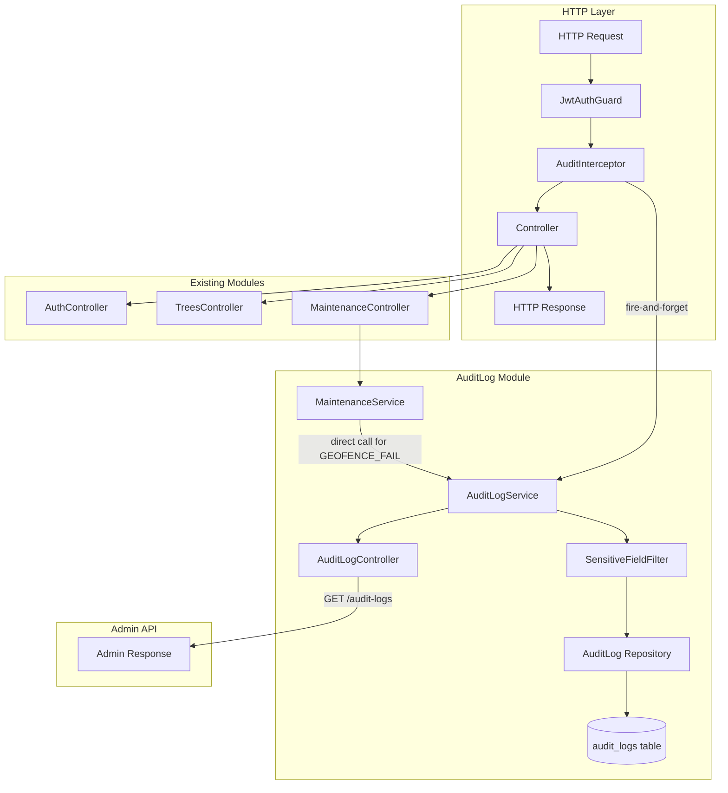

# Design Document: Audit Log System

## Overview

The Audit Log System adds a cross-cutting security and traceability layer to the Urban Green Infrastructure Management System NestJS backend. It records all critical user actions — authentication events, tree CRUD operations, and maintenance task lifecycle events — into a persistent `audit_logs` PostgreSQL table.

Logging is performed asynchronously (fire-and-forget) via a NestJS interceptor so that audit failures never impact the main request flow. Sensitive data (passwords, tokens) is stripped before storage. The system integrates with the existing Auth, Trees, and Maintenance modules with minimal changes to those modules.

### Key Design Decisions

1. **Fire-and-forget via RxJS `tap`**: The interceptor uses `tap` on the response observable to trigger the audit write after the response is determined, without blocking it. Errors from the audit write are caught silently.

2. **GEOFENCE_FAIL via direct service injection**: Because the geofencing check throws a `ForbiddenException` inside `MaintenanceService.completeTask()`, the interceptor cannot distinguish a geofence failure from a generic forbidden error. `MaintenanceService` will directly inject `AuditLogService` and call `create()` before throwing, so the correct `GEOFENCE_FAIL` action is recorded.

3. **LOGIN_FAIL via interceptor `catchError`**: The interceptor wraps the response observable with both `tap` (success path) and `catchError` (error path), re-throwing after logging so the original HTTP error response is preserved.

4. **Integration tests with mocked repository**: E2E tests in `backend/test/audit-log.e2e-spec.ts` override the `AuditLog` TypeORM repository with an in-memory mock to avoid requiring a real test database, while still exercising the full HTTP flow with SuperTest.

5. **Per-route configuration**: The interceptor is instantiated with `new AuditInterceptor(auditLogService, { action, entity })` and applied via `@UseInterceptors()` on individual routes, keeping audit configuration co-located with the route definition.

---

## Architecture



### Request Flow — Success Path

```
Request → JwtAuthGuard → AuditInterceptor.intercept()
  → next.handle() [controller executes]
  → tap(response) → AuditLogService.create() [async, non-blocking]
  → HTTP 200/201 response returned immediately
```

### Request Flow — Error Path (e.g., LOGIN_FAIL)

```
Request → AuditInterceptor.intercept()
  → next.handle() [controller throws UnauthorizedException]
  → catchError(err) → AuditLogService.create() [async, non-blocking]
  → re-throw err → NestJS exception filter → HTTP 401 response
```

### GEOFENCE_FAIL Flow

```
Request → AuditInterceptor (action=TASK_COMPLETE) → MaintenanceController.completeTask()
  → MaintenanceService.completeTask()
    → distance > 10m
    → AuditLogService.create({ action: GEOFENCE_FAIL, ... })  ← direct call
    → throw ForbiddenException
  → catchError in interceptor → re-throw (no second audit write for GEOFENCE_FAIL)
  → HTTP 403 response
```

---

## Components and Interfaces

### File Structure

New files to create:

```
backend/src/
├── entities/
│   └── auditLog.entity.ts              # AuditLog TypeORM entity
├── modules/
│   └── audit-log/
│       ├── auditLog.module.ts          # NestJS module
│       ├── auditLog.service.ts         # Persistence service
│       ├── auditLog.service.spec.ts    # Unit tests for service
│       ├── auditLog.interceptor.ts     # NestJS interceptor
│       ├── auditLog.interceptor.spec.ts # Unit tests for interceptor
│       ├── auditLog.controller.ts      # Admin GET /audit-logs endpoint
│       ├── sensitiveFieldFilter.ts     # Deep-remove sensitive keys
│       ├── sensitiveFieldFilter.spec.ts # Unit tests for filter
│       └── dto/
│           └── create-audit-log.dto.ts # DTO for service.create()

backend/test/
└── audit-log.e2e-spec.ts               # Integration tests
```

Modified files:

```
backend/src/
├── app.module.ts                        # Import AuditLogModule
├── modules/
│   ├── auth/
│   │   ├── auth.module.ts              # Import AuditLogModule
│   │   └── auth.controller.ts          # Add @UseInterceptors on login
│   ├── trees/
│   │   ├── trees.module.ts             # Import AuditLogModule
│   │   └── trees.controller.ts         # Add @UseInterceptors on POST/GET routes
│   └── maintenance/
│       ├── maintenance.module.ts       # Import AuditLogModule
│       ├── maintenance.controller.ts   # Add @UseInterceptors on task routes
│       └── maintenance.service.ts      # Inject AuditLogService for GEOFENCE_FAIL
```

### AuditInterceptor Interface

```typescript
// Configuration passed when instantiating the interceptor
interface AuditInterceptorConfig {
  action: AuditAction;
  entity: AuditEntity;
}

// Usage on a route:
@UseInterceptors(new AuditInterceptor(auditLogService, { action: AuditAction.TREE_CREATE, entity: AuditEntity.TREE }))
```

The interceptor is instantiated with `new AuditInterceptor(service, config)` rather than injected as a class, because per-route configuration requires passing different `action`/`entity` values per route. The `AuditLogService` is injected into the controller constructor and passed to the interceptor instance.

### AuditLogService Interface

```typescript
interface AuditLogService {
  create(dto: CreateAuditLogDto): Promise<void>;
  findAll(): Promise<AuditLog[]>;
}

interface CreateAuditLogDto {
  userId?: number | null;
  action: AuditAction;
  entity: AuditEntity;
  entityId?: string | null;
  metadata?: Record<string, any> | null;
  requestBody?: Record<string, any> | null;
  responseStatus: number;
  gpsLatitude?: number | null;
  gpsLongitude?: number | null;
  ipAddress: string;
  userAgent: string;
}
```

`create()` never throws — all errors are caught internally and logged to the NestJS logger.

### SensitiveFieldFilter Interface

```typescript
// Pure function — no class needed
function filterSensitiveFields(obj: Record<string, any>): Record<string, any>;

const SENSITIVE_KEYS = ['password', 'token', 'access_token'];
```

Performs a deep clone with recursive removal of any key matching `SENSITIVE_KEYS`. Returns a new object; does not mutate the input.

---

## Data Models

### AuditLog Entity

```typescript
// backend/src/entities/auditLog.entity.ts

import {
  Entity, Column, PrimaryGeneratedColumn, CreateDateColumn, Index,
} from 'typeorm';

export enum AuditAction {
  LOGIN_SUCCESS     = 'LOGIN_SUCCESS',
  LOGIN_FAIL        = 'LOGIN_FAIL',
  LOGOUT            = 'LOGOUT',
  TREE_CREATE       = 'TREE_CREATE',
  TREE_READ         = 'TREE_READ',
  TREE_UPDATE       = 'TREE_UPDATE',
  TREE_DELETE       = 'TREE_DELETE',
  TASK_CREATE       = 'TASK_CREATE',
  TASK_READ         = 'TASK_READ',
  TASK_UPDATE       = 'TASK_UPDATE',
  TASK_ASSIGN       = 'TASK_ASSIGN',
  TASK_COMPLETE     = 'TASK_COMPLETE',
  TASK_STATUS_UPDATE = 'TASK_STATUS_UPDATE',
  GEOFENCE_FAIL     = 'GEOFENCE_FAIL',
  FORBIDDEN         = 'FORBIDDEN',
  VALIDATION_ERROR  = 'VALIDATION_ERROR',
}

export enum AuditEntity {
  AUTH = 'auth',
  TREE = 'tree',
  TASK = 'task',
}

@Entity('audit_logs')
export class AuditLog {
  @PrimaryGeneratedColumn('uuid')
  id: string;

  @Index()
  @Column({ type: 'int', nullable: true })
  user_id: number | null;

  @Index()
  @Column({ type: 'varchar', length: 50 })
  action: AuditAction;

  @Column({ type: 'varchar', length: 50 })
  entity: AuditEntity;

  @Column({ type: 'varchar', length: 255, nullable: true })
  entity_id: string | null;

  @Column({ type: 'jsonb', nullable: true })
  metadata: Record<string, any> | null;

  @Column({ type: 'jsonb', nullable: true })
  request_body: Record<string, any> | null;

  @Column({ type: 'int' })
  response_status: number;

  @Column({ type: 'decimal', precision: 10, scale: 7, nullable: true })
  gps_latitude: number | null;

  @Column({ type: 'decimal', precision: 10, scale: 7, nullable: true })
  gps_longitude: number | null;

  @Column({ type: 'varchar', length: 45 })
  ip_address: string;

  @Column({ type: 'varchar', length: 500 })
  user_agent: string;

  @Index()
  @CreateDateColumn()
  created_at: Date;
}
```

**Design notes:**
- `id` is UUID (not auto-increment integer) to avoid sequential ID enumeration in admin APIs.
- `action` is stored as `varchar` rather than a PostgreSQL native enum to allow adding new enum values without a migration.
- `gps_latitude`/`gps_longitude` use `decimal(10,7)` — sufficient precision for GPS coordinates (±0.0000001° ≈ 1 cm).
- `ip_address` is `varchar(45)` to accommodate IPv6 addresses.
- `user_agent` is `varchar(500)` to handle long mobile browser strings.
- `metadata` and `request_body` are `jsonb` for efficient querying and indexing in PostgreSQL.

### CreateAuditLogDto

```typescript
// backend/src/modules/audit-log/dto/create-audit-log.dto.ts

export class CreateAuditLogDto {
  userId?: number | null;
  action: AuditAction;
  entity: AuditEntity;
  entityId?: string | null;
  metadata?: Record<string, any> | null;
  requestBody?: Record<string, any> | null;
  responseStatus: number;
  gpsLatitude?: number | null;
  gpsLongitude?: number | null;
  ipAddress: string;
  userAgent: string;
}
```

---

## Correctness Properties

*A property is a characteristic or behavior that should hold true across all valid executions of a system — essentially, a formal statement about what the system should do. Properties serve as the bridge between human-readable specifications and machine-verifiable correctness guarantees.*

### Property Reflection

Before writing the final properties, reviewing the prework for redundancy:

- Properties from 2.1 (sensitive keys removed) and 2.5 (non-sensitive keys preserved) can be combined into a single round-trip/invariant property: "filtering removes exactly the sensitive keys and preserves everything else."
- Properties from 7.3 (TASK_COMPLETE GPS round-trip) and 7.4 (GEOFENCE_FAIL GPS round-trip) share the same invariant — GPS coordinates submitted are stored exactly. These can be combined into one property: "for any GPS coordinates submitted in a task completion request (success or failure), the AuditLog stores those exact coordinates."
- Property 6.4 (user_id captured for tree operations) and the general user_id capture rule are specific instances of a broader invariant: "for any authenticated request to an audited route, the AuditLog stores the correct user_id." This is a single property.
- Property 11.1 (no sensitive data in any AuditLog) is the database-level consequence of the filter property (2.1+2.5). It is a distinct property because it validates the end-to-end pipeline, not just the filter function in isolation. Keep both.

Final non-redundant properties: **4 properties**.

---

### Property 1: Sensitive Field Filter Correctness

*For any* object (at any nesting depth) containing an arbitrary mix of sensitive keys (`password`, `token`, `access_token`) and non-sensitive keys, applying `filterSensitiveFields` SHALL produce an object where:
- all sensitive keys are absent at every nesting level, and
- all non-sensitive keys are present with their original values unchanged.

**Validates: Requirements 2.1, 2.2, 2.5**

---

### Property 2: GPS Coordinate Round-Trip

*For any* valid GPS coordinate pair (latitude, longitude) submitted in the body of a `POST /maintenance/tasks/:id/complete` request — regardless of whether the request succeeds (`TASK_COMPLETE`) or fails the geofence check (`GEOFENCE_FAIL`) — the resulting `AuditLog` record SHALL store `gps_latitude` and `gps_longitude` values that are equal to the submitted coordinates.

**Validates: Requirements 7.3, 7.4**

---

### Property 3: Authenticated User ID Capture

*For any* authenticated HTTP request to an audited route, the resulting `AuditLog` record SHALL have a `user_id` equal to the value of `req.user.userId ?? req.user.id` from the decoded JWT, regardless of which user is making the request or which audited route is called.

**Validates: Requirements 4.3, 6.4**

---

### Property 4: No Sensitive Data in Persisted Audit Logs

*For any* `AuditLog` record persisted to the database (regardless of the action type or which endpoint triggered it), neither the `request_body` JSONB column nor the `metadata` JSONB column SHALL contain the keys `password`, `token`, or `access_token` at any nesting level.

**Validates: Requirements 2.3, 2.4, 11.1**

---

## Error Handling

### AuditInterceptor Error Handling

The interceptor uses RxJS operators to handle both success and error paths:

```typescript
intercept(context: ExecutionContext, next: CallHandler): Observable<any> {
  const req = context.switchToHttp().getRequest();
  // ... extract request data

  return next.handle().pipe(
    tap((responseBody) => {
      // Success path: response body available
      this.writeAuditLog(req, 200, responseBody).catch(() => {});
    }),
    catchError((err: HttpException | Error) => {
      // Error path: exception thrown by controller/service
      const status = err instanceof HttpException ? err.getStatus() : 500;
      this.writeAuditLog(req, status, null, err).catch(() => {});
      return throwError(() => err); // re-throw to preserve original error response
    }),
  );
}
```

**Key points:**
- `tap` fires after the observable emits (response ready) but does not block it.
- `catchError` fires when the observable errors, logs the audit record, then re-throws so NestJS exception filters handle the HTTP response normally.
- `writeAuditLog()` is a private async method; `.catch(() => {})` ensures any failure in the audit write is silently discarded.
- The interceptor never swallows the original error.

### GEOFENCE_FAIL Special Handling

`MaintenanceService.completeTask()` is modified to inject `AuditLogService` and call it directly before throwing:

```typescript
if (distance > this.MAX_DISTANCE_METERS) {
  // Log GEOFENCE_FAIL before throwing — interceptor cannot distinguish this from FORBIDDEN
  await this.auditLogService.create({
    userId,
    action: AuditAction.GEOFENCE_FAIL,
    entity: AuditEntity.TASK,
    entityId: String(taskId),
    metadata: { distance: parseFloat(distance.toFixed(1)), maxDistance: this.MAX_DISTANCE_METERS },
    requestBody: filterSensitiveFields(completeDto as any),
    responseStatus: 403,
    gpsLatitude: completeDto.latitude,
    gpsLongitude: completeDto.longitude,
    ipAddress: '',   // not available in service layer; interceptor will also log FORBIDDEN — see note
    userAgent: '',
  }).catch(() => {});
  throw new ForbiddenException(`You must be within ${this.MAX_DISTANCE_METERS} meters...`);
}
```

> **Note on double-logging**: The `AuditInterceptor` on `POST /maintenance/tasks/:id/complete` is configured with `action = TASK_COMPLETE`. When a `ForbiddenException` is thrown (for any reason), the interceptor's `catchError` will log a `TASK_COMPLETE` record with status 403. To avoid this double-log for the geofence case, the interceptor on the complete route should use a sentinel action `TASK_COMPLETE` and the `catchError` path should check the error message: if it contains "geofence" or "meters", skip the interceptor log (the service already logged `GEOFENCE_FAIL`). Alternatively, a custom exception class `GeofenceException` can be used to distinguish the two cases cleanly.

**Recommended approach**: Introduce a `GeofenceException extends ForbiddenException` in `MaintenanceService`. The interceptor's `catchError` checks `err instanceof GeofenceException` and skips logging if true (the service already logged it).

### AuditLogService Error Handling

```typescript
async create(dto: CreateAuditLogDto): Promise<void> {
  try {
    const log = this.auditLogRepository.create({ ... });
    await this.auditLogRepository.save(log);
  } catch (err) {
    this.logger.error('Failed to write audit log', err);
    // Never re-throw — audit failures must not affect the main request
  }
}
```

---

## Testing Strategy

### Unit Tests

**`sensitiveFieldFilter.spec.ts`**
- Verify removal of `password`, `token`, `access_token` at top level
- Verify deep removal in nested objects
- Verify non-sensitive fields are preserved
- Verify null/undefined input handling
- Verify arrays containing objects with sensitive keys

**`auditLog.service.spec.ts`**
- `create()` saves a record with correct field mapping
- `create()` never throws when repository throws
- `create()` calls `filterSensitiveFields` on `requestBody` and `metadata`
- `findAll()` returns all records ordered by `created_at` DESC

**`auditLog.interceptor.spec.ts`**
- Extracts `user_id` from `req.user.userId` (primary)
- Extracts `user_id` from `req.user.id` (fallback)
- Sets `user_id = null` when `req.user` is absent
- Extracts GPS from request body when present
- Sets GPS to null when absent from request body
- Calls `AuditLogService.create()` with correct action/entity from config
- On success path: calls `create()` with response status 200/201
- On error path: calls `create()` with error status, then re-throws
- Does not block response when `AuditLogService.create()` is slow

### Property-Based Tests

The project uses Jest. For property-based testing, **`fast-check`** will be used (pure TypeScript, no additional runtime dependencies, integrates directly with Jest).

Install: `npm install --save-dev fast-check`

Each property test runs a minimum of **100 iterations**.

**Property 1 — Sensitive Field Filter Correctness** (`sensitiveFieldFilter.spec.ts`):
```
// Feature: audit-log-system, Property 1: Sensitive field filter correctness
fc.assert(fc.property(
  arbitraryObjectWithSensitiveKeys(),
  (obj) => {
    const filtered = filterSensitiveFields(obj);
    return (
      !containsSensitiveKey(filtered) &&
      allNonSensitiveKeysPreserved(obj, filtered)
    );
  }
), { numRuns: 100 });
```

**Property 4 — No Sensitive Data in Persisted Audit Logs** (`auditLog.service.spec.ts`):
```
// Feature: audit-log-system, Property 4: No sensitive data in persisted audit logs
fc.assert(fc.property(
  arbitraryCreateAuditLogDto(),
  async (dto) => {
    await service.create(dto);
    const saved = mockRepo.lastSaved;
    return (
      !containsSensitiveKey(saved.request_body) &&
      !containsSensitiveKey(saved.metadata)
    );
  }
), { numRuns: 100 });
```

**Property 2 — GPS Coordinate Round-Trip** and **Property 3 — Authenticated User ID Capture** are validated through the integration tests (see below), as they require the full HTTP pipeline.

### Integration Tests (`backend/test/audit-log.e2e-spec.ts`)

The integration tests use SuperTest with a full NestJS application. The `AuditLog` TypeORM repository is replaced with an in-memory mock that stores records in an array, avoiding the need for a real test database.

**Test setup pattern:**
```typescript
const auditLogs: AuditLog[] = [];
const mockAuditRepo = {
  create: (dto) => ({ ...dto }),
  save: async (log) => { auditLogs.push(log); return log; },
  find: async () => auditLogs,
};

const moduleFixture = await Test.createTestingModule({
  imports: [AppModule],
})
  .overrideProvider(getRepositoryToken(AuditLog))
  .useValue(mockAuditRepo)
  .compile();
```

**Key test scenarios:**

1. **Auth — Login success**: POST valid credentials → assert `AuditLog` with `action=LOGIN_SUCCESS`, `user_id` set, `request_body` has no `password`.
2. **Auth — Login failure**: POST invalid credentials → assert `AuditLog` with `action=LOGIN_FAIL`, `user_id=null`.
3. **Trees — TREE_CREATE**: POST valid tree → assert `AuditLog` with `action=TREE_CREATE`, `entity_id` = new tree ID, `metadata.tree_code` present.
4. **Maintenance — TASK_COMPLETE with GPS**: POST complete within 10 m → assert `AuditLog` with `action=TASK_COMPLETE`, `gps_latitude`/`gps_longitude` match submitted values. *(Validates Property 2)*
5. **Maintenance — GEOFENCE_FAIL**: POST complete from > 10 m → assert `AuditLog` with `action=GEOFENCE_FAIL`, GPS coordinates match. *(Validates Property 2)*
6. **Full mobile workflow**: Login → GET my tasks → PATCH status → POST complete with GPS → assert audit trail has LOGIN_SUCCESS, TASK_STATUS_UPDATE, TASK_COMPLETE records in order.
7. **Security — no sensitive data**: After login request, assert no `AuditLog` record contains `password`/`token`/`access_token` in `request_body` or `metadata`. *(Validates Property 4 end-to-end)*
8. **Resilience — audit failure**: Override `AuditLogService.create` to throw → assert HTTP response still returns expected status code and body. *(Validates Requirement 3.2)*
9. **User ID capture**: Authenticated POST /trees → assert `AuditLog.user_id` matches JWT sub. *(Validates Property 3)*
10. **FORBIDDEN**: Attempt to complete another user's task → assert `AuditLog` with `action=FORBIDDEN`, HTTP 403.

### Module Integration Changes

**`auth.controller.ts`** — login route:
```typescript
@Post('login')
@HttpCode(HttpStatus.OK)
@UseInterceptors(new AuditInterceptor(auditLogService, {
  action: AuditAction.LOGIN_SUCCESS,  // success path
  entity: AuditEntity.AUTH,
  errorActionMap: { 401: AuditAction.LOGIN_FAIL },
}))
async login(@Body() loginDto: LoginDto): Promise<AuthResponseDto> { ... }
```

**`trees.controller.ts`** — create route:
```typescript
@Post()
@UseInterceptors(new AuditInterceptor(auditLogService, {
  action: AuditAction.TREE_CREATE,
  entity: AuditEntity.TREE,
  extractEntityId: (response) => String(response.id),
  extractMetadata: (response) => ({ tree_code: response.tree_code, species_id: response.species_id }),
}))
async create(@Body() createTreeDto: CreateTreeDto) { ... }
```

**`maintenance.controller.ts`** — complete task route:
```typescript
@Post('tasks/:id/complete')
@UseInterceptors(new AuditInterceptor(auditLogService, {
  action: AuditAction.TASK_COMPLETE,
  entity: AuditEntity.TASK,
  extractEntityId: (_, req) => req.params.id,
  skipOnGeofenceException: true,  // GEOFENCE_FAIL is logged by MaintenanceService directly
}))
async completeTask(...) { ... }
```

### AuditLogModule

```typescript
@Module({
  imports: [TypeOrmModule.forFeature([AuditLog])],
  controllers: [AuditLogController],
  providers: [AuditLogService],
  exports: [AuditLogService],
})
export class AuditLogModule {}
```

Imported by `AuthModule`, `TreesModule`, `MaintenanceModule`, and `AppModule`.

### Admin API

```
GET /audit-logs
Authorization: Bearer <jwt>
```

Protected by `JwtAuthGuard`. Returns all audit log records ordered by `created_at` DESC. Future enhancement: add pagination and filtering by `action`, `user_id`, `entity`, date range.

Response shape:
```json
[
  {
    "id": "uuid",
    "user_id": 3,
    "action": "TREE_CREATE",
    "entity": "tree",
    "entity_id": "42",
    "metadata": { "tree_code": "TREE-001", "species_id": 5 },
    "request_body": { "tree_code": "TREE-001" },
    "response_status": 201,
    "gps_latitude": null,
    "gps_longitude": null,
    "ip_address": "127.0.0.1",
    "user_agent": "Mozilla/5.0 ...",
    "created_at": "2025-01-15T10:30:00.000Z"
  }
]
```
